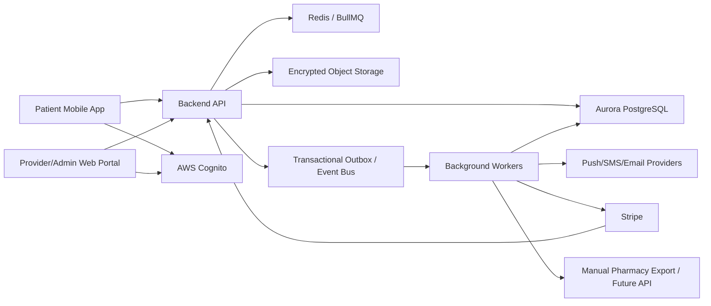
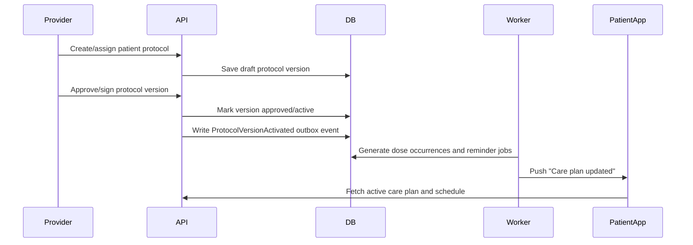
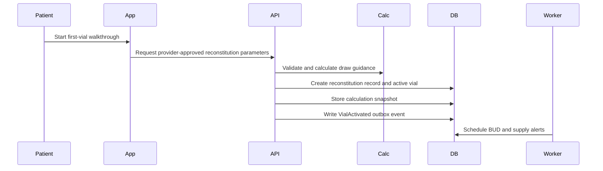
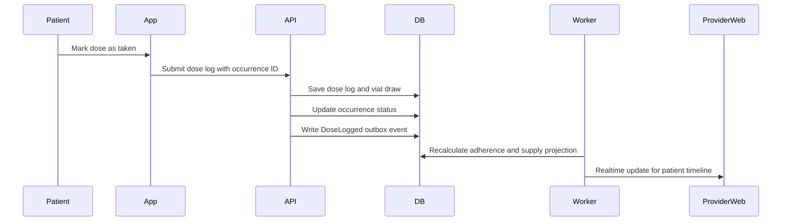
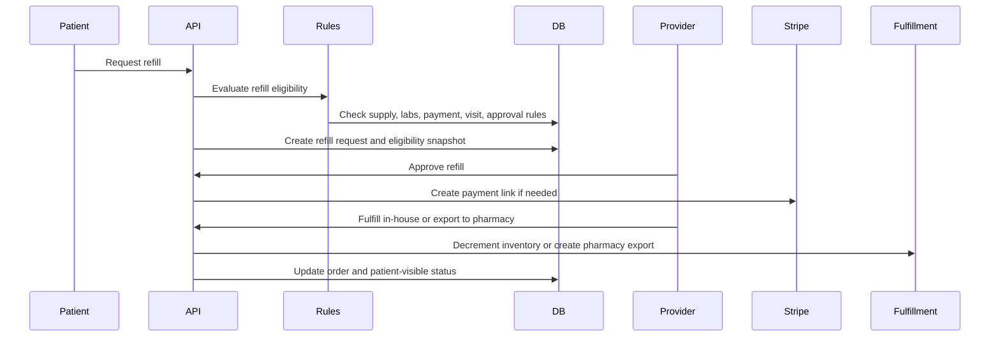

# Beacon Technical Architecture

**Product:** Beacon, a peptide program platform for medspas and health clinics  
**Source requirements:** `PRD.md`, Draft v1, last updated 2026-05-19  
**Architecture status:** Draft v1

---

## 1. Architecture Goals

Beacon has two jobs that must work together:

1. Give patients a reliable mobile companion for dosing, reconstitution, vial tracking,
   symptoms, refills, and communication.
2. Give clinics an operational console for protocols, monitoring, inventory, orders,
   documentation, and compliance.

The technical architecture should optimize for:

- **Clinical safety:** no autonomous prescribing, no unapproved dose changes, strong audit
  trails, and clear provider approval boundaries.
- **Peptide-specific correctness:** exact unit conversion, syringe-unit guidance,
  titration/cycle scheduling, active-vial tracking, BUD alerts, and supply projection.
- **Operational speed:** MVP should ship as a modular monolith, not a distributed system.
- **Compliance readiness:** HIPAA-ready vendor choices, encryption, access control, audit
  logs, PHI-safe notifications, and breach-response support.
- **Multi-tenant clinic operations:** each clinic has its own patients, providers,
  locations, inventory, products, templates, and billing setup.
- **Real-time shared state:** provider changes appear in the patient app quickly; patient
  logs and alerts appear in the clinic console quickly.
- **Backend-owned clinical state:** clients can render, cache, and queue patient-entered
  events, but the backend owns all clinical state, protocol state, and clinical
  calculations.

---

## 2. Recommended System Shape

### 2.1 High-Level Components



### 2.2 MVP Deployment Model

Use a **modular monolith backend** with clear module boundaries. Split into services later
only when scale, compliance, or team ownership requires it.

Recommended MVP runtime:

- **Patient mobile app:** React Native with Expo, native push, camera, secure storage, and
  health integration bridges as needed.
- **Provider/admin portal:** React + Vite single-page app.
- **Backend API:** NestJS TypeScript modular monolith.
- **Data access:** Drizzle with explicit SQL control and PostgreSQL row-level security.
- **Auth:** AWS Cognito with MFA for clinic users and app-bound sessions for patients.
- **Database:** AWS Aurora PostgreSQL.
- **Queue/cache:** Redis and BullMQ for job transport, rate limiting, short-lived locks, and
  WebSocket fanout. PostgreSQL outbox events remain the durable source for domain events.
- **Object storage:** S3 with SSE-KMS encryption for photos, labs, documents, and exports.
- **Background jobs:** BullMQ workers for reminders, BUD alerts, refill checks,
  notifications, PDF generation, exports, and webhook processing.
- **Payments:** Stripe.
- **Notifications:** APNS/FCM for push, Twilio for SMS, SendGrid or SES for email.
- **Hosting:** AWS ECS Fargate behind ALB/WAF, with Aurora, ElastiCache, S3, KMS,
  CloudWatch, and Secrets Manager.

The backend can later be split into separate services around high-change domains:
notifications, integrations, analytics, and pharmacy fulfillment.

---

## 3. Repository Layout

Suggested monorepo:

```text
apps/
  mobile/                 # Patient app
  web/                    # Provider/admin portal
  api/                    # Backend API
  workers/                # Background workers
packages/
  domain/                 # Shared domain types and validation schemas
  calculations/           # Reconstitution, units, supply projection
  ui/                     # Shared web UI primitives, if useful
  config/                 # ESLint, TypeScript, build config
infra/
  terraform/              # Cloud infrastructure
  docker/                 # Local/dev containers
docs/
  api/                    # OpenAPI specs, API examples
  compliance/             # Security, audit, breach-response docs
```

Keep clinical calculation logic in a shared package that is tested heavily and imported by
the API. The mobile app renders backend-generated calculation snapshots; it never computes
authoritative dosing, protocol, or reconstitution guidance locally.

---

## 4. Frontend Architecture

### 4.1 Patient Mobile App

Primary responsibilities:

- Invite-based onboarding.
- Care plan and active protocol display.
- Reconstitution walkthrough and syringe-unit visualization.
- Active-vial setup, BUD display, and supply burn-down.
- Dose schedule, reminders, logging, missed-dose handling.
- Injection-site rotation UI.
- Symptoms, side effects, outcomes, progress photos, labs/doc uploads.
- Messaging, refill requests, appointment links, education.

Mobile storage model:

- Cache the active care plan, next dose occurrences, active vial metadata, education, and
  recent messages.
- Cache immutable calculation snapshots for display only.
- Store sensitive cached data in encrypted device storage.
- Queue offline logs locally and sync once online.
- Treat server state as authoritative for protocol parameters, dose schedules, and
  reconstitution parameters.
- Invalidate cached care plans, dose schedules, and calculation snapshots when the active
  protocol version changes.

Offline behavior:

- Allow the patient to view already-synced protocol instructions.
- Allow the patient to view the last valid cached calculation snapshot for the active
  protocol version, but never compute a new snapshot offline.
- Allow dose logs and symptom logs to be created offline.
- Block protocol edits and refill submission until online.
- On reconnect, submit queued logs with client-generated IDs for idempotency.

### 4.2 Provider/Admin Web Portal

Primary responsibilities:

- Clinic dashboard and worklists.
- Patient roster and longitudinal patient profile.
- Protocol template builder and patient-specific care plan assignment.
- Reconstitution parameter entry and approval.
- Adherence monitoring, side-effect triage, and refill queue.
- Inventory, orders, dispensing logs, lot/expiration tracking.
- Messaging inbox, forms, consents, documents, labs, appointments.
- Clinic admin: users, roles, locations, branding, notification settings, billing.

Real-time portal behavior:

- Use WebSocket subscriptions for:
  - new patient dose logs,
  - side-effect alerts,
  - refill requests,
  - message notifications,
  - order status changes,
  - inventory low-stock warnings.

---

## 5. Backend Architecture

### 5.1 API Style

Use REST/JSON with OpenAPI for the core API. This is simple, testable, and friendly to
mobile clients and integrations. The public API starts at `/v1`.

Use WebSockets for realtime updates. Do not put core mutations on the realtime channel; all
state-changing operations should go through authenticated API endpoints.

API standards:

- Idempotency keys on create/log/checkout/order/refill endpoints.
- Backward compatibility across at least two supported mobile app versions.
- Additive response changes by default; breaking changes require a new API version.
- Server-driven minimum-supported-app-version checks for hard breaks or urgent security
  updates.
- Cursor pagination for lists.
- Server-generated timestamps.
- Optimistic concurrency on clinical objects using `version` or `updated_at` preconditions.
- Strict request validation at the API boundary.
- Tenant scoping required on every clinic-owned resource.

Mobile compatibility rules:

- Never require a forced app update for ordinary backend releases.
- Keep deprecated fields available until the supported mobile window has passed.
- Version clinical-display contracts such as calculation snapshots explicitly.
- Use feature flags or server-driven capabilities for newly launched mobile behavior.

### 5.2 Realtime Sync

Realtime uses backend-owned WebSocket channels plus Redis pub/sub fanout across API
instances. WebSocket messages carry lightweight invalidation events, not full clinical
state. Clients refetch the authoritative resource over REST.

Examples:

```text
protocol.updated -> refetch /v1/patients/me/care-plan
dose.logged -> refetch /v1/provider/patients/{id}/timeline
side_effect.flagged -> refetch /v1/provider/triage
refill.status_changed -> refetch /v1/patients/me/refills/{id}
```

This keeps one source of truth, reduces state-merge bugs, and lets the mobile app safely
discard stale cached protocol, schedule, or calculation snapshot data.

### 5.3 Domain Modules

The backend should be organized into modules that can remain in one deployable application:

| Module | Responsibilities |
|--------|------------------|
| Identity & Access | Auth, sessions, MFA, RBAC, clinic membership, patient access. |
| Clinics | Clinics, locations, branding, settings, provider licenses. |
| Patients | Patient profiles, intake, goals, care team, clinic relationships. |
| Protocols | Templates, patient protocols, versions, titration, cycles, stacks, approvals. |
| Calculations | Unit conversion, reconstitution, syringe units, doses-per-vial, supply projection. |
| Scheduling | Dose occurrence generation, reminders, late/missed dose detection. |
| Vials & Supply | Vial records, BUD, reconstitution events, active vial state, runout projections. |
| Dose Logs | Taken/missed/skipped doses, injection sites, adherence calculations. |
| Symptoms & Outcomes | Side effects, red flags, progress metrics, photos, trend data. |
| Messaging & Triage | Threads, messages, side-effect inbox, assignments, SLA timers. |
| Refills & Orders | Eligibility rules, refill queue, order creation, fulfillment paths. |
| Inventory | Products, lots, locations, stock movements, dispensing log, recall lookup. |
| Payments | Stripe customers, invoices, subscriptions, payment links, webhook handling. |
| Appointments | Scheduling records, external telehealth links, reminders, questionnaires. |
| Labs & Documents | Uploads, lab values, releases, consents, forms, PDF exports. |
| Notifications | Push/SMS/email templates, delivery preferences, retries, PHI-safe payloads. |
| Audit & Compliance | Immutable audit logs, access logs, export logs, retention controls. |
| Analytics | Operational metrics, cohort summaries, reporting projections. |
| Integrations | Stripe, SMS/email, scheduling, future pharmacy/labs/EHR connectors. |

---

## 6. Data Architecture

### 6.1 Database Strategy

PostgreSQL is the source of truth for transactional state.

Core rules:

- All clinic-owned rows include `clinic_id`.
- All patient-owned rows include `patient_id`.
- Use UUIDs or ULIDs for public IDs.
- Use `numeric`/decimal for medication amounts. Never use floating point for clinical
  calculations.
- Store both source units and normalized units where appropriate.
- Keep append-only records for clinical events wherever possible.
- Use soft deletion for clinical and audit-relevant records.
- Use immutable versioning for protocol changes.

### 6.2 Multi-Tenancy Model

Use a shared database with strict tenant isolation:

- `clinics` own locations, staff, templates, products, inventory, settings, and billing.
- `patients` can belong to more than one clinic through `clinic_patient_memberships`.
- Provider/staff access is scoped by `clinic_user_memberships`.
- Application-level authorization is mandatory at every module boundary.
- PostgreSQL row-level security is enabled from the first migration for tenant-scoped PHI
  tables.
- The request context sets the active clinic/user scope before any tenant-scoped query.
- Data-access helpers must fail closed when no tenant scope is present.
- RLS is defense-in-depth, not a replacement for application authorization.

### 6.3 Core Tables

Identity and tenancy:

```text
users
user_sessions
clinics
clinic_locations
clinic_user_memberships
roles
role_permissions
providers
provider_licenses
patients
clinic_patient_memberships
patient_care_team_assignments
```

Protocols and scheduling:

```text
peptide_products
protocol_templates
protocol_template_versions
protocol_template_items
patient_protocols
patient_protocol_versions
patient_protocol_items
titration_steps
cycle_rules
monitoring_requirements
red_flag_rules
dose_occurrences
dose_logs
injection_site_logs
```

Vials, reconstitution, and supply:

```text
vial_records
reconstitution_records
calculation_snapshots
vial_dose_draws
supply_projection_snapshots
bud_policy_rules
```

Symptoms, outcomes, labs, and documents:

```text
symptom_logs
side_effect_events
triage_cases
outcome_metric_definitions
outcome_metric_logs
progress_photos
lab_orders
lab_results
lab_values
documents
document_permissions
forms
form_versions
form_submissions
consent_records
```

Messaging and appointments:

```text
message_threads
messages
message_attachments
thread_assignments
appointments
appointment_questionnaires
```

Refills, orders, inventory, and payments:

```text
refill_requests
refill_eligibility_checks
orders
order_items
fulfillment_records
pharmacy_exports
inventory_locations
inventory_lots
inventory_transactions
dispensing_records
recall_events
stripe_customers
payment_intents
invoices
subscriptions
```

Notifications, audit, and events:

```text
notification_preferences
notification_templates
notification_deliveries
audit_events
access_events
outbox_events
webhook_events
data_exports
retention_jobs
```

---

## 7. Peptide-Specific Engines

### 7.1 Unit and Reconstitution Engine

This is Beacon's most important correctness boundary.

The unit and reconstitution engine is a pure, no-I/O module. It accepts validated inputs,
returns deterministic outputs, and does not read from the database, call services, publish
events, or inspect runtime context. Clinical math never uses floating point.

The engine should support:

- mg to mcg conversion.
- prescribed dose in mg or mcg.
- vial peptide amount in mg or mcg.
- diluent volume stored as integer microliters.
- concentration as mcg/mL.
- syringe type, especially U-100 insulin syringes.
- syringe units to draw.
- doses-per-vial estimate.
- draw-volume validation against syringe capacity.

Authoritative formula model:

```text
vial_amount_mcg = normalize(vial_amount, vial_amount_unit)
prescribed_dose_mcg = normalize(prescribed_dose, prescribed_dose_unit)
diluent_volume_microliters = normalize(diluent_volume, diluent_volume_unit)
concentration_mcg_per_microliter = vial_amount_mcg / diluent_volume_microliters
dose_volume_microliters = prescribed_dose_mcg / concentration_mcg_per_microliter
syringe_units = dose_volume_microliters * syringe_units_per_microliter
estimated_doses_per_vial = floor(vial_amount_mcg / prescribed_dose_mcg)
```

For a U-100 insulin syringe:

```text
syringe_units_per_microliter = 0.1
```

Rules:

- Store and compute masses in integer micrograms and volumes in integer microliters where
  possible. Use an explicit decimal library when fractional display precision is required.
- Never use JavaScript `number` floating-point arithmetic for clinical calculations.
- Round display values explicitly by syringe type and clinic policy.
- Generate and persist the exact calculation snapshot used for each patient-facing
  instruction.
- Store who configured or approved the parameters.
- Block patient-side edits to clinical parameters unless the clinic explicitly enables a
  non-authoritative calculator mode.
- Flag impossible or suspicious configurations:
  - zero or negative diluent volume,
  - dose volume greater than syringe capacity,
  - dose greater than vial amount,
  - non-integer syringe unit display when clinic requires whole-unit guidance,
  - mismatched units or missing concentration.

### 7.2 Calculation Snapshots

`calculation_snapshots` are immutable, append-only records generated by the backend and
rendered by the mobile app. They are the evidence trail for what Beacon told a patient to
draw at a point in time.

A calculation snapshot is tied to:

- clinic,
- patient,
- patient protocol version,
- protocol item,
- vial or reconstitution record,
- approving provider,
- calculation engine version,
- rounding policy,
- generated timestamp.

Minimum snapshot payload:

```text
vial_amount_mcg
diluent_volume_microliters
prescribed_dose_mcg
concentration_mcg_per_microliter
dose_volume_microliters
syringe_type
syringe_units_per_microliter
syringe_units_to_draw
rounding_policy
rounding_disclosure
generated_from_protocol_version_id
approved_by_provider_id
calculation_engine_version
```

Client rules:

- The app renders snapshots; it never independently computes authoritative dosing guidance.
- The app refuses to display a snapshot whose `generated_from_protocol_version_id` no longer
  matches the active protocol version once it learns about the version change.
- Offline, the app may show the last valid cached snapshot for the active protocol version,
  clearly using cached data, but it must not generate a new one.
- A protocol version change invalidates future dose schedules and calculation snapshots.

### 7.3 Protocol Engine

The protocol engine owns the authoritative treatment plan.

Core concepts:

- A protocol template is reusable clinic content.
- A patient protocol is an assigned, patient-specific instance.
- Every patient protocol has immutable versions.
- Only approved protocol versions can generate patient-visible schedules.
- Dose occurrences reference the protocol version that generated them.

The engine must support:

- multiple protocol items in a stack,
- titration schedules,
- cycle schedules,
- start/end dates,
- provider-authored instructions,
- monitoring requirements,
- required labs/forms/photos,
- refill rules,
- red-flag symptom rules,
- reconstitution parameters.

Protocol version lifecycle:

```text
draft -> pending_provider_approval -> approved -> active -> superseded
```

Any clinical change creates a new version. Previously logged doses stay attached to the
version that was active when they were logged.

### 7.4 Dose Schedule Engine

Use a materialized schedule for the next rolling window, for example 90 days.

Why materialize:

- mobile clients need reliable offline upcoming doses,
- reminders need concrete scheduled jobs,
- adherence calculations need expected vs actual occurrences,
- protocol changes can create a clear before/after boundary.

The scheduler should:

- generate dose occurrences from active protocol versions,
- account for titration step boundaries,
- account for cycle on/off periods,
- generate occurrences per protocol item in a stack,
- regenerate future occurrences when a new protocol version is approved,
- preserve past occurrences and logs,
- mark occurrences as due, taken, missed, skipped, late, or cancelled.

### 7.5 Vial and Supply Engine

The vial engine connects reconstitution, dosing, BUD, and refills.

Vial states:

```text
planned -> active -> exhausted -> discarded -> replaced
```

Core calculations:

- BUD date = reconstitution date + clinic/product BUD policy, unless provider override.
- remaining peptide amount = initial normalized vial amount - sum(logged drawn dose amount).
- remaining doses = floor(remaining peptide amount / current prescribed dose).
- runout date = projected from remaining scheduled occurrences.
- refill warning date = runout date minus clinic-configured lead time.

Rules:

- BUD alerts should fire before expiration and on expiration.
- Doses logged after BUD should be allowed only with explicit warning and audit.
- If a protocol dose changes, supply projection recalculates from future dose occurrences.
- Discarded or replaced vials should remain in the history.

### 7.6 Injection-Site Rotation Engine

Represent injection sites with a normalized body map:

```text
abdomen_left
abdomen_right
thigh_left
thigh_right
arm_left
arm_right
glute_left
glute_right
custom
```

The engine should:

- suggest the next site based on recent logs,
- warn on repeated use of the same site within clinic-configured limits,
- store site notes and optional photos,
- expose site history to the provider.

---

## 8. End-to-End Workflows

### 8.1 Provider Assigns a Protocol



### 8.2 Patient Reconstitutes a Vial



### 8.3 Patient Logs a Dose



### 8.4 Patient Requests a Refill



---

## 9. Rules Engines

### 9.1 Refill Eligibility Rules

Eligibility checks should be explicit and stored as snapshots:

- remaining doses,
- estimated runout date,
- protocol timing,
- required labs complete,
- required forms complete,
- follow-up visit complete or scheduled,
- payment status,
- provider approval status,
- inventory availability for in-house dispensing,
- pharmacy export readiness for external fulfillment.

Store both the result and the reasons:

```text
eligible: false
blocking_reasons:
  - required_lab_missing
  - follow_up_required
warnings:
  - inventory_lot_expires_soon
```

### 9.2 Triage Rules

Triage rules are clinic/protocol configurable:

- symptom type,
- severity threshold,
- duration threshold,
- associated protocol item,
- escalation target,
- required follow-up questions,
- patient-facing guidance,
- SLA timer.

Severe symptoms should create a triage case, notify the care team, and record the full
decision path in the audit log.

---

## 10. Events and Background Jobs

### 10.1 Transactional Outbox

Use the transactional outbox pattern for domain events. The API writes business changes and
an `outbox_events` row in the same database transaction. Workers then publish/process the
event.

This prevents common failures where a clinical state change commits but the reminder,
alert, or realtime update is lost.

Important events:

```text
PatientInvited
PatientActivated
ConsentCompleted
ProtocolVersionApproved
ProtocolVersionActivated
DoseOccurrenceDue
DoseLogged
DoseMissed
SideEffectLogged
RedFlagTriggered
VialActivated
VialBudApproaching
VialExpired
SupplyLow
RefillRequested
RefillApproved
OrderCreated
OrderFulfilledInHouse
PharmacyExportCreated
InventoryLow
InventoryLotExpiring
MessageCreated
AppointmentScheduled
PaymentSucceeded
PaymentFailed
DocumentUploaded
LabReleasedToPatient
```

### 10.2 Background Job Types

- Dose reminder scheduling.
- Missed-dose detection.
- BUD alerts.
- Supply/runout projection.
- Refill eligibility refresh.
- Side-effect triage escalation.
- Notification delivery and retry.
- Stripe webhook processing.
- Inventory low-stock and expiring-lot checks.
- PDF generation for care plans, consents, progress reports.
- Data export jobs.
- Retention/deletion jobs.

---

## 11. Security, Privacy, and Compliance

### 11.1 Authentication

Recommended:

- AWS Cognito for user pools, hosted auth primitives, token issuance, and MFA policy.
- Email/password plus mandatory MFA for provider/admin/staff users.
- Patient auth with app-bound trusted sessions. Email or SMS magic links may be used as a
  convenience or recovery path, but SMS alone is not sufficient for ongoing PHI access.
- Passkeys should be evaluated for patient login after MVP foundation work.
- Device/session management with remote revocation.
- Short-lived access tokens and refresh tokens.
- Session revocation.
- Optional SSO for larger clinics in a later phase.

### 11.2 Authorization

Use role-based access control plus resource-level checks.

Example roles:

```text
clinic_owner
clinic_admin
provider
rn
medical_assistant
health_coach
billing_staff
inventory_manager
patient
pharmacy_partner
support_admin
```

Clinical authorization rules:

- Only licensed/authorized provider roles can approve protocols and dose changes.
- Staff can draft but not approve clinical parameters unless their role permits it.
- Patients cannot modify authoritative clinical parameters.
- Clinic staff can only access patients assigned to their clinic and permitted scope.
- Support/admin access must be break-glass, time-limited, justified, and audited.

### 11.3 Audit Logging

Audit logs should be append-only and queryable. Audit events should also stream to
write-once storage, such as an S3 bucket with Object Lock/WORM retention, so breach
investigations do not rely only on mutable database rows.

Audit all:

- login/logout and failed access attempts,
- patient chart views,
- protocol template changes,
- patient protocol assignments,
- provider approvals/signatures,
- reconstitution parameter changes,
- dose logs and edits,
- side-effect triage changes,
- refill approvals/denials,
- order fulfillment,
- inventory movements,
- document views/downloads,
- consent signatures,
- payment status changes,
- support access.

Minimum audit fields:

```text
id
clinic_id
actor_user_id
actor_role
patient_id
resource_type
resource_id
action
before_hash
after_hash
ip_address
user_agent
reason
created_at
```

### 11.4 PHI-Safe Notifications

Push/SMS/email notifications should avoid sensitive details.

Good:

```text
You have a new message from your clinic.
It is time to check your Beacon app.
Your refill request status changed.
```

Avoid:

```text
Take 250 mcg of [peptide] now.
Your nausea from [protocol] was escalated.
Your lab result is abnormal.
```

### 11.5 Encryption and Secrets

- TLS everywhere.
- Database encryption at rest.
- Object storage encryption with managed KMS keys.
- Secrets in a managed secret store.
- Signed, short-lived URLs for private documents/photos.
- Field-level encryption may be added for highly sensitive fields.
- Separate production, staging, and development environments.

### 11.6 Compliance Operations

The system should support:

- vendor BAA inventory,
- access reports,
- patient data export,
- retention and deletion workflows,
- breach investigation support,
- FTC Health Breach Notification Rule evidence collection,
- clinic-level audit exports,
- support access review.

---

## 12. Inventory and Fulfillment Architecture

### 12.1 Product Catalog

`peptide_products` should represent what the clinic sells/dispenses, including:

- display name,
- route,
- vial amount,
- unit,
- default diluent volume,
- default BUD policy,
- storage instructions,
- active/inactive status,
- optional SKU,
- clinic-specific pricing metadata.

### 12.2 Inventory Lots

Inventory is lot-based:

- clinic location,
- product,
- lot number,
- expiration date,
- quantity on hand,
- quantity reserved,
- source/supplier,
- status.

### 12.3 Inventory Transactions

Use an append-only inventory ledger:

```text
received
dispensed
reserved
reservation_released
wasted
adjusted
transferred
recalled
expired
```

Current stock is derived from the ledger or maintained as a projection with reconciliation.

### 12.4 Fulfillment Paths

In-house dispensing:

1. Provider approves refill/order.
2. Staff selects lot.
3. System validates lot expiration and quantity.
4. System creates dispensing record.
5. Inventory decrements.
6. Patient sees order status update.

Manual pharmacy submission:

1. Provider approves refill/order.
2. System creates structured pharmacy export.
3. Staff submits through the pharmacy's external workflow.
4. Staff updates status and shipment tracking manually.
5. Future Phase 3 pharmacy API replaces manual steps.

---

## 13. Payments Architecture

Stripe is the MVP payment provider.

Core principles:

- Clinical approval and payment collection are separate.
- Payment success does not imply clinical approval.
- Clinical approval does not imply payment success.
- Webhooks are idempotent and stored before processing.

Payment objects:

- Stripe customer linked to patient and clinic.
- Payment intent for one-time charges.
- Subscription for memberships/programs.
- Invoice records mirrored locally.
- Payment link for refill/order payment.

Order states should make the separation explicit:

```text
draft
pending_clinical_approval
approved
awaiting_payment
paid
ready_for_fulfillment
fulfilled
shipped
delivered
cancelled
denied
```

---

## 14. Analytics Architecture

MVP analytics can run from PostgreSQL read models. Do not introduce a warehouse until Phase
2 unless reporting load demands it.

Recommended layers:

1. Transactional tables for source data.
2. Read-model tables or materialized views for dashboards.
3. Scheduled aggregation jobs for clinic metrics.
4. Phase 2 warehouse for cohort analytics and BI.

MVP read models:

- patient adherence summary,
- active vial/supply summary,
- refill queue summary,
- side-effect worklist summary,
- inventory risk summary,
- revenue summary,
- provider response-time summary.

---

## 15. Integrations

### MVP

- Stripe for payments.
- Twilio for SMS.
- SendGrid or SES for email.
- APNS/FCM for push.
- Manual pharmacy export.
- External telehealth links stored on appointments.

### Phase 2

- E-signature provider.
- Scheduling provider.
- Wearables and mobile health platforms.
- Data warehouse/BI.
- Embedded telehealth video with BAA.

### Phase 3

- Pharmacy fulfillment APIs.
- Lab vendor APIs.
- EHR/EMR sync.
- Lab parsing.
- AI-assisted summaries and triage suggestions with provider review.

Integration pattern:

- Each integration has its own adapter.
- External IDs are stored in mapping tables.
- Webhooks are saved raw before processing.
- Processing is idempotent.
- Failures create retryable jobs and operational alerts.

Adapter interfaces:

| Concern | Interface | MVP Implementation | Later Implementation |
|---------|-----------|--------------------|----------------------|
| Payments | `PaymentProvider` | Stripe | N/A |
| SMS/email | `MessagingProvider` | Twilio / SendGrid or SES | N/A |
| Push | `PushProvider` | APNS / FCM | N/A |
| Pharmacy | `PharmacyFulfillmentProvider` | Structured export and manual status updates | Partner APIs |
| Telehealth | `TelehealthProvider` | Stored external visit link | Embedded video vendor with BAA |
| Labs | `LabProvider` | Manual upload and entry | Quest, Labcorp, Rupa, Health Gorilla |
| Wearables | `WearableProvider` | None in MVP | Apple Health, Google Health Connect, Oura, Whoop |
| EHR | `EhrProvider` | None in MVP | Elation, Athena, DrChrono, Charm, AdvancedMD |

---

## 16. Reliability and Observability

### 16.1 Service-Level Expectations

MVP target:

- API availability: 99.9% target after launch hardening; 99.5% is acceptable during
  private beta.
- Reminder delivery should be outbox-backed, retryable, and observable.
- Mobile dose reminders should use local notification fallback where possible so already
  synced reminders can still fire during short API outages.
- Clinical data writes should be strongly consistent.
- Analytics can be eventually consistent.
- Database RPO target: 5 minutes using Aurora PITR and continuous backups.
- Initial RTO target: 4 hours, to be tightened after restore drills and launch traffic.

### 16.2 Monitoring

Track:

- API latency and error rate,
- worker queue depth,
- failed jobs,
- notification delivery failures,
- webhook failures,
- database performance,
- storage access errors,
- authentication failures,
- audit log write failures,
- reminder job lag,
- outbox processing lag.

### 16.3 Logging

- Use structured logs.
- Do not log PHI in application logs.
- Include request IDs, actor IDs, clinic IDs, and resource IDs where safe.
- Send security-relevant events to a protected audit stream.

---

## 17. Testing Strategy

Highest-priority test areas:

- Unit conversion and reconstitution calculations.
- Property tests for calculation monotonicity, unit round trips, and invalid inputs.
- Clinician-reviewed golden cases for common peptide/vial/dose combinations.
- Calculation snapshot immutability, version tagging, and stale-version invalidation.
- Syringe-unit rounding.
- BUD calculation.
- Dose schedule generation for titration, cycles, and stacks.
- Supply projection after dose changes.
- Refill eligibility rules.
- Inventory decrement and lot selection.
- Authorization and tenant isolation.
- PostgreSQL RLS policies for tenant-scoped tables.
- Audit log generation.
- Stripe webhook idempotency.
- Offline mobile dose-log sync.

Test layers:

- Domain unit tests for calculation and scheduling engines.
- API integration tests with Postgres.
- Authorization tests for every role.
- Mobile UI tests for first-dose/reconstitution flow.
- Web UI tests for protocol approval, refill queue, and inventory fulfillment.
- End-to-end tests for the core loop:
  provider assigns protocol -> patient reconstitutes vial -> patient logs dose -> supply
  projection updates -> refill request -> provider approval -> order fulfillment.

---

## 18. MVP Implementation Plan

### Milestone 1: Foundation

- Monorepo and CI.
- Expo capability spike: camera, secure storage, push, health bridges, local notifications,
  and syringe visualization feasibility.
- Cognito spike: multi-tenant claims, custom auth UX, MFA, app-bound patient sessions, and
  token/session revocation.
- Auth, users, clinics, roles, patient memberships.
- PostgreSQL schema baseline with RLS enabled for tenant-scoped PHI tables.
- Audit log foundation.
- Object storage and signed URLs.
- Notification infrastructure.

### Milestone 2: Protocol and Calculation Core

- Product catalog.
- Protocol templates and patient protocol assignment.
- Protocol versioning and provider approval.
- Reconstitution calculation package.
- Immutable calculation snapshots tied to protocol version, vial/reconstitution record, and
  approving provider.
- Titration/cycle schedule generation.
- Patient treatment plan API.

### Milestone 3: Patient Dose Loop

- Mobile care plan screen.
- First-vial/reconstitution walkthrough.
- Active vial and BUD tracking.
- Dose reminders.
- Dose logging and missed-dose logging.
- Injection-site rotation.
- Supply projection.

### Milestone 4: Provider Monitoring

- Patient roster and profile.
- Adherence dashboard.
- Dose timeline.
- Side-effect logging and triage inbox.
- Secure messaging.

### Milestone 5: Refills, Orders, and Inventory

- Refill request flow.
- Eligibility rules engine.
- In-house fulfillment path.
- Inventory lots and ledger.
- Manual pharmacy export.
- Order status updates.

### Milestone 6: Commerce, Documents, and Launch Hardening

- Stripe payment links and webhook processing.
- Consent/form basics.
- Labs/doc uploads.
- Appointment records with external telehealth links.
- Basic analytics.
- Security review, audit review, backup/restore drill, breach-response runbook.

---

## 19. Key Technical Decisions

| Decision | Recommendation | Rationale |
|----------|----------------|-----------|
| Backend shape | Modular monolith | Faster MVP, easier transactions/audit, simpler compliance boundary. |
| Patient mobile | React Native with Expo | Native app capabilities with one TypeScript codebase for a small team. |
| Provider/admin web | React + Vite SPA | Authenticated operational app; SSR is not required. |
| Backend framework | NestJS | Strong module boundaries for bounded contexts. |
| Data access | Drizzle | Explicit SQL control for RLS-heavy clinical queries. |
| Auth | AWS Cognito | BAA-capable AWS auth primitive with MFA and session support. |
| Database | Aurora PostgreSQL with RLS from day one | Strong relational fit plus defense-in-depth tenant isolation. |
| Clinical calculations | Pure no-I/O calculation package, backend authoritative | Prevent duplicate divergent math across clients. |
| Calculation display | Immutable audited calculation snapshots | Evidence trail for what the app told a patient to draw. |
| Scheduling | Materialized dose occurrences | Supports reminders, offline mobile, adherence, and auditability. |
| Events | Transactional outbox | Reliable alerts, reminders, and realtime sync after DB commits. |
| API | REST + OpenAPI under `/v1` | Simple mobile/web integration, typed clients, and mobile compatibility. |
| Realtime | WebSocket invalidation + REST refetch | Provider worklists and patient updates without client-side state merging. |
| Inventory | Append-only ledger | Auditability and recall support. |
| Payments | Stripe | Strong MVP payment/link/subscription support. |
| Jobs | Redis/BullMQ workers backed by PostgreSQL outbox | Fast worker transport without making Redis the durable event source. |
| Hosting | AWS ECS Fargate HIPAA-ready stack | Mature BAA-capable infrastructure without Kubernetes operations. |

---

## 20. Open Technical Questions

1. **Blocks Milestone 1:** React Native with Expo is the default patient mobile choice. Does
   the Expo spike reveal any requirement that forces pure Swift/Kotlin or a custom native
   module?
2. **Blocks Milestone 1:** Cognito is the default auth provider. Does the Cognito spike
   reveal any blocker around multi-tenant claims, custom patient auth UX, MFA, or session
   revocation?
3. **Blocks Milestone 2:** Should provider signatures be simple authenticated approvals in
   MVP, or formal e-signatures from day one?
4. **Blocks Milestone 1/3 onboarding:** What level of patient identity verification is
   required before treatment access?
5. **Blocks Milestone 5:** Which pharmacy export format is required for the first clinic
   customers?
6. **Blocks Milestone 1/3 onboarding:** Which state-licensure rules must be enforced at
   launch versus flagged for staff review?
7. **Blocks Milestone 2/3 vial engine:** What is the clinic's default BUD policy per
   peptide/product, and can providers override it?
8. **Blocks Milestone 6 labs/documents:** How much patient-entered lab data should be
   trusted before provider review?
9. **Blocks Milestone 1 notifications:** What are the exact PHI rules for push/SMS/email
   copy?
10. **Blocks Milestone 6 launch hardening:** What is the minimum audit export format
    required for clinic admins?

---

## 21. Summary

Beacon should be built as a compliance-ready, event-driven modular monolith with a native
patient app, a web clinic console, PostgreSQL as the source of truth, and a heavily tested
peptide calculation/scheduling core.

The most important engineering work is not generic CRUD. It is getting the peptide-specific
engines right:

- reconstitution and syringe-unit guidance,
- provider-approved protocol versioning,
- titration and cycle schedule generation,
- active vial and BUD tracking,
- supply projection,
- injection-site rotation,
- refill eligibility tied to adherence, labs, visits, payment, and inventory.

Those engines are the product moat and should be treated as the highest-risk, highest-value
part of the system.
